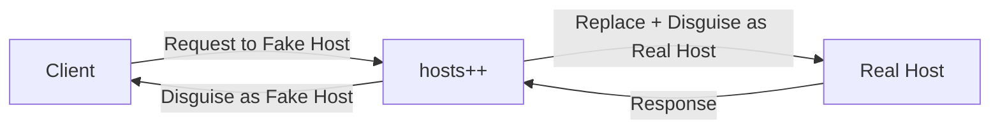
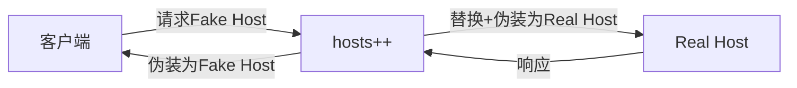

# Hosts Plus Plus (hosts++)

[English](#english) | [中文](#中文)

## English

### Introduction

Hosts Plus Plus (hosts++) is a MITM proxy tool for customizing and redirecting HTTP/HTTPS requests based on user-defined rules. It allows users to replace request hosts, enabling seamless redirection from a fake host to a real host while maintaining the appearance of communication with the fake host.

### Workflow

### Tech Stack

- MITM Proxy: Golang
- Rule Configuration Panel: React + Vite

### Features

- Custom rule-based host replacement
- HTTPS traffic interception and decryption
- User-friendly configuration interface
- Efficient request/response handling

### Installation and Usage

(To be added)

### Disclaimer

This project is for research and learning purposes only. Users are responsible for compliance with applicable laws and regulations.

## 中文

### 项目介绍

Hosts Plus Plus (hosts++) 是一个基于用户自定义规则的 MITM 代理工具，用于自定义和重定向 HTTP/HTTPS 请求。它允许用户替换请求主机，实现从假主机到真实主机的无缝重定向，同时保持与假主机通信的外观。

### 工作流程

### 技术栈

- MITM 代理：Golang
- 规则配置面板：React + Vite

### 功能特性

- 基于自定义规则的主机替换
- HTTPS 流量拦截和解密
- 用户友好的配置界面
- 高效的请求/响应处理

### 安装和使用

（待添加）

### 免责声明

本项目仅供研究和学习使用。用户需自行遵守适用的法律法规。